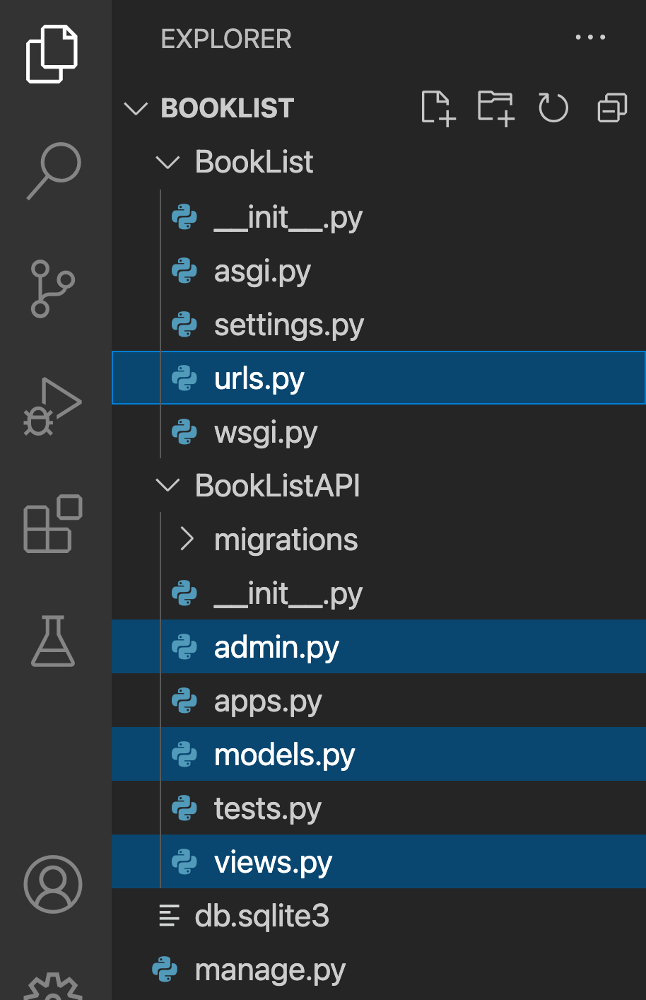
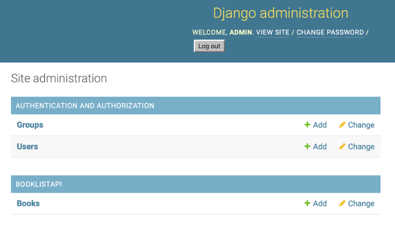
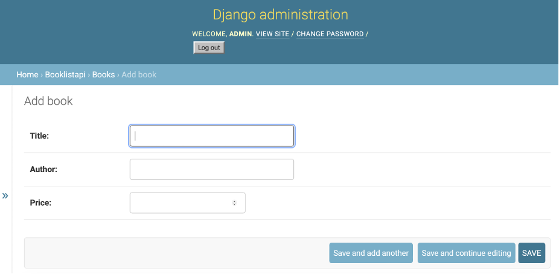

# C6M1L4 Item 05 - Your First API


## Introduction

In this lesson, you learned how to create and organize a **Booklist API** project, and now you understand the consequences of a poorly designed API. You will have the opportunity to apply what you've learned. In this exercise, you will create a Booklist project using plain Django. This means you will need to create all the necessary API endpoints, including those to add new books, list available books, and search for a specific book. 

## Goal

Your goal for this exercise is to create your project using plain Django and implement the features discussed in the video on the Booklist API project.

## Objectives

- Practice creating a Django model for a database table
- Create a function-based view
- Run the server to display the output of your APIs
- Use GET and POST methods to update a database table built from the model

## Scenario

You've been hired by the manager of a bookshop to create a website and mobile application to streamline the management of their books. The manager should be able to add books on both the app and the website. Additionally, both the manager and visitors should be able to browse the available selection of books and search for a specific book. For this project, you will develop the necessary APIs to support these features.

## Setup

This lab will require you to modify the following files:

- models.py
- views.py
- admin.py
- urls.py (app-level)
- urls.py (project-level)



Additionally, you are required to use the command line console inside the terminal of VS Code.

Go to VS Code inside the Coursera lab environment. If not open already, go to **Terminal** on the menu bar at the top of your screen and select **New Terminal**.

You have already built the project named **BookList** and added an app inside the project called **BookListAPI**.

Follow the instructions below and ensure you check the output at every step and update the necessary files to create different views.

**Note:** Before you begin, make sure you understand how to work with the Coursera Code Lab for the [APIS course](https://www.coursera.org/learn/apis/supplement/WXiq5/working-with-labs-in-this-course).


## Steps

**Step 1:**

Open the **models.py** file and create a class called `Book` inside it and pass `models.Model` to it as a parameter.

**Step 2:**

Create the three attributes you need in the model and assign the respective form fields to them.

Additionally, pass the following arguments to those form fields.

| **Attribute** | **Form field type** | **Arguments** |
| --- | --- | --- |
| title | CharField | max\_length = 255 |
| author | CharField | max\_length = 255 |
| price | DecimalField | max\_digits=5, decimal\_places=2 |

**Tip:** _Recall that the form fields are imported from the model's package._

**Step 3:**

Create a class inside the model class `Book` called `Meta`.

Inside the `Meta` class, create a variable called `indexes` and assign a list to it that contains one element as below.

``` models.Index(fields=['price']), ```

**Note:** _This is contrary to the use of elements present in a typical Python list but you should keep the comma (`,`) as also shown in the code in case of `urlpatterns`_

**Step 4:**

Open the file **admin.py** and remove the comments from the following lines **#2** and **#4**:

```
# from .models import Book

# admin.site.register(Book)

```

**Step 5:**

Now go to the terminal and run the two commands to perform migrations. The result will be similar to the screenshots below.


**Note:** _There is likely misconfiguration in some of the code if the migrations are not performed as expected. Explore the error stack trace to detect the file that may be in conflict._

**Step 6:**

Once the migrations are performed, you are ready to run the server. Go to the terminal and run the server.


**Note:** It should generate a URL for the localhost such as: **http://127.0.0.1:8000**

**Step 7:**

Now go to the URL **http://127.0.0.1:8000/admin** admin and run the enter the credentials on the login page for the Django-admin panel as below:

**username: admin**

**password: books@123!**

**Note:** The login for a superuser account with the username admin for the Django admin using the command `createsuperuser`.

**Step 8**

- 8.1 On the homepage of the Django admin, select the option Books as visible in the image below:



- 8.2 Select the option ADD BOOK in the right hand corner:


- 8.3 You need to enter the details of the books you want to create in the text boxes shown below:



Create the following entries and SAVE both the book details entered.

**- Title: Northanger Abbey**
**- Author: Jane Austen**
**- Price: 18.20**

**- Title: Siddhartha**
**- Author: Hermann Hesse**
**- Price: 6.50**

**Step 9:**
Create a file in the `BookListAPI` directory called **urls.py** and add the following code inside it.

```
from django.urls import path
from . import views


urlpatterns = [
# Add URL configuration for the path() function here
]

```

Replace the comment inside the `urlpatterns` with the `path()` function with two arguments passed inside it:

* A URL configuration for the `path` such as a string called `books`
* A relative path for the view function `books` that you are going to create

**Step 10:**
Go to the project-level **urls.py** inside the **BookList** and observe the URL configurations already added in-place. Remove the commenting of the line **#21**:

`# path('api/', include('BookListAPI.urls')),`

**Step 11:**
Go to the file **views.py** inside the **BookListAPI** directory and import the following:

- The `IntegrityError` exception from the `package django.db`
- `JsonResponse` function from the `package django.http`
- The `Book` model from the **models.py** file present inside the same directory
- The `csrf_exempt` decorator function from the package `django.views.decorators.csrf`
- The `model_to_dict` function from the package `django.forms.model`


**Tip:** Note that when importing a file inside the same directory, you need to use a dot operator in front of the file while importing. For example, a package named `xyz` from inside file called `abc` will be imported as follows:

`from .abc import xyz`

**Step 12:**

Add the decorator for `csrf_exempt` before you begin writing the view function.

**Tip:** _The decorators are helper functions used in Python that have `@` as the suffix. For reference, the decorators will be used over the view function as below:_


**Step 13:**

On the next line, define a view function called `books` and pass a request object to it as a parameter. Implement the code by following the steps in the pseudo-code below.

If the value of `request.method` is `'GET'`:

- Assign the value of `Book.objects.all().values()` to a variable called `books`
- Return the `JsonResponse()` from the view that has a dictionary passed inside it whose key is the string `'books'` and whose value is the variable `books` typecasted to a *list* object

Else if the value of `request.method` is `'POST'`:

- Assign `request.POST.get('title')` to a variable title
- Assign `request.POST.get('author')` to a variable author
- Assign `request.POST.get('price')` to a variable price
- Now create another variable called `book` and assign it a `Book` object that has three arguments passed for `title`, `author` and `price` in a format that follows variable assignment such as: 
`title = title` and so on.
- Add a `try` block:

-  Call the `save()` function on the `book` variable by using the dot operator.

- Add an `except` block to check `IntegrityError`:

-  Return the JsonResponse() with the following code present inside it: `{'error':'true','message':'required field missing'},status=400`

- Return a `JsonResponse()` that contains two arguments passed to it: `model_to_dict(books)` and `status=201`


_**Note:** Double-check the code created for the view function to ensure there are no errors. Errors may occur in one or more places, but Python and Django will flag them one at a time. In this example, the views have conditional statements which should be double-checked for accuracy._


**Step 14:**

Run the server and go to the URL specified in the command line followed by the suffix that you have configured inside the URL configurations. The URL to be accessed on the browser will be:

**http://127.0.0.1:8000/api/books**

The output will be similar to the screenshot below.


**Additional Step**

Update the code inside the files **models.py** and **views.py** to add another variable called `inventory` for the books.

You will also have to re-perform migrations for the code and add new entries using the POST method. See if the field inventory displays along with the remaining fields.

## **Concluding Thoughts**

In this lab, you practiced creating your first API using Django and you implemented the GET and POST methods to update the database table built from the model. You also practiced creating function- based views, and running the server to access specific entries inside the database.