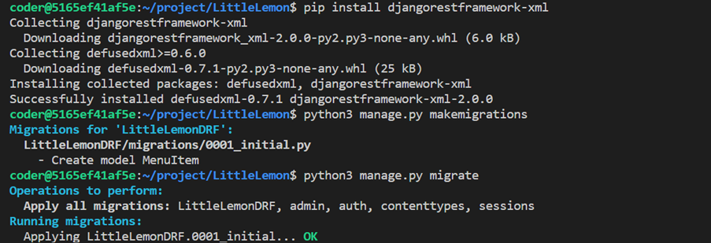
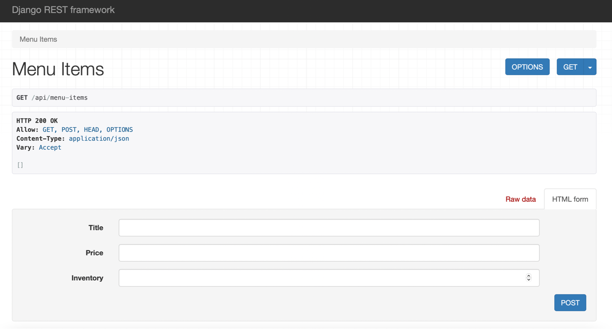
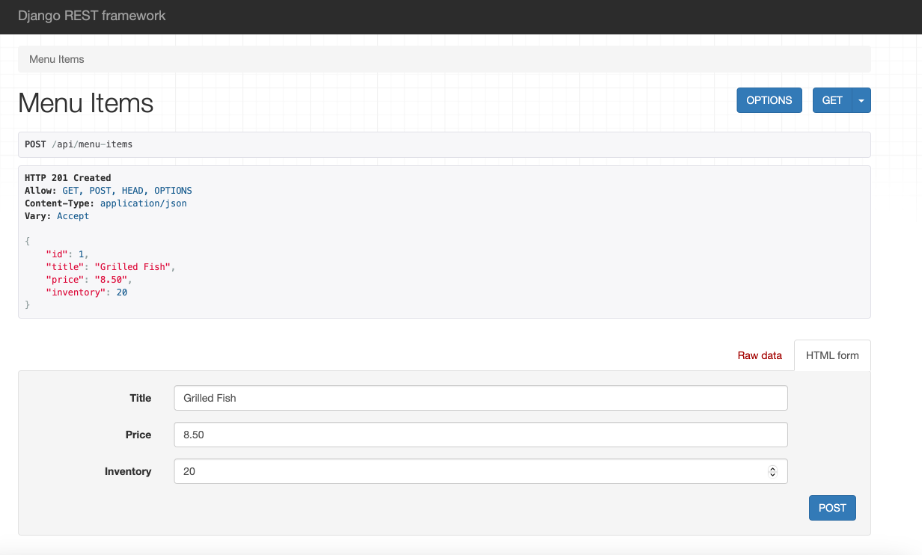
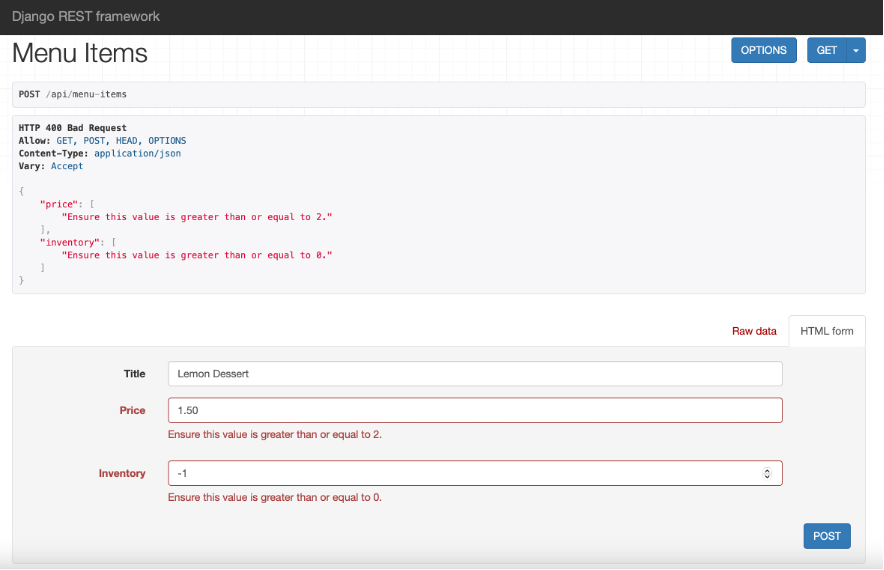
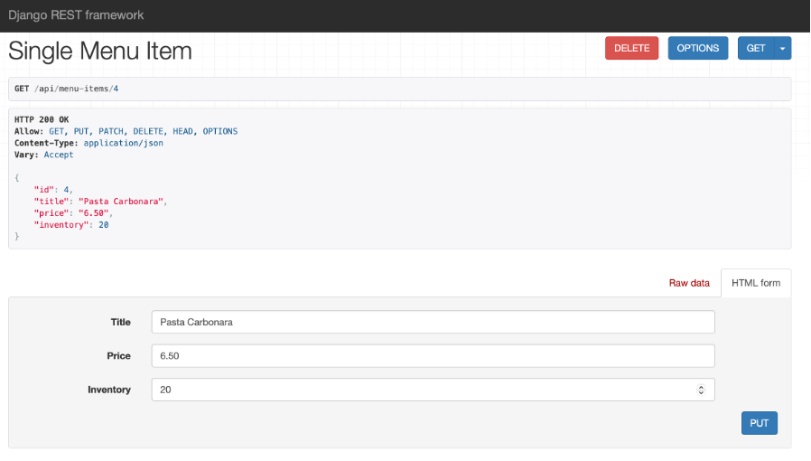
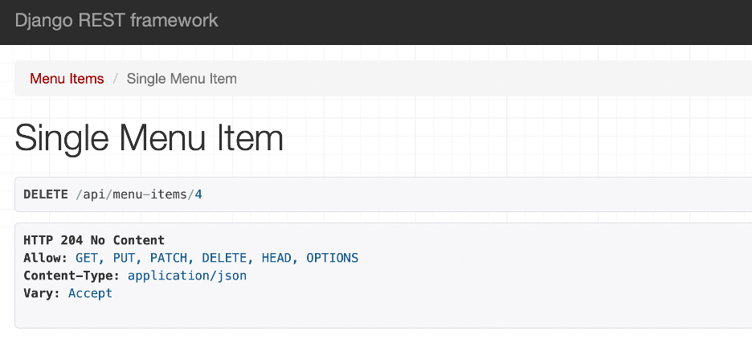
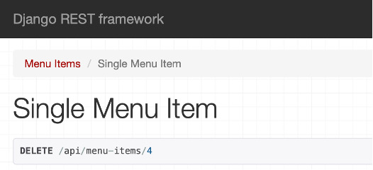
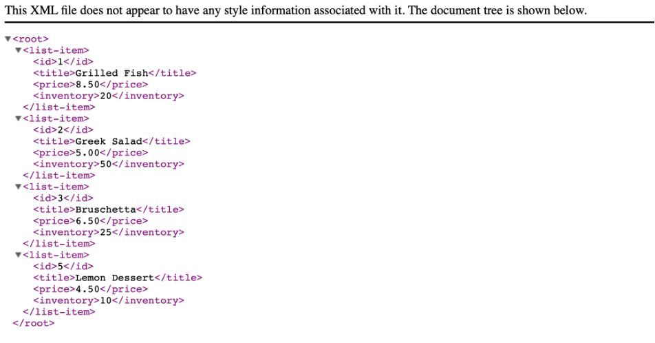

# C6M2L2 Item 08 - Restaurant Menu API using Serialization


**Goal**

In this lab, you will use serialization, validation and deserialization techniques to display API data in JSON and XML format using DRF.

**Objectives**

- Create HTML forms with DRF and add new items inside it
- Validate form data that has been added with DRF

**Introduction**

In this lab, you will create an API for updating the Menu of the Little Lemon restaurant.

**Scenario**

You have been tasked with creating an app and website for the Little Lemon restaurant that will allow the managers to update the inventory and price of menu items.

**Learner Instructions**

This lab requires you to modify the following files:

- **views.py**

- **urls.py** (on app-level)
- **serializers.py**
- **models.py**
- **settings.py**

Start the development server on the localhost and go to the URL to confirm the desired view on the webpage.

When required, Open the **Terminal** by selecting **New Terminal** under the **Terminal** Menu option in VSCode.

The Django project called **LittleLemon** and Django app called **LittleLemonDRF** are already in place.

**Note:** Before you begin, make sure you understand how to work with the Coursera Code Lab for the [APIS course](https://www.coursera.org/learn/apis/supplement/WXiq5/working-with-labs-in-this-course).


Follow the instructions below and ensure you check the output at every step.

**Note:** The settings for the project level and app level **urls.py** file have already been updated.

**Instructions**

**Step 1:**

Open the **models.py** file and create a class called `MenuItem` inside it and pass `models.Model` to it as a parameter.

**Step 2:**

Create the three attributes you need in the model (`title`, `price` and `inventory`) and assign the respective form fields to them. Additionally, pass the following arguments to those form fields:

| **Attribute**   | **Form field type**   | **Arguments**   |
| --- | --- | --- |
| title  | CharField  | max\_length = 255  |
| price  | DecimalField  | max\_digits=6, decimal\_places=2  |
| inventory  | SmallIntegerField  |


**Step 3:**

Now create a file called **serializers.py** inside the **LittleLemonDRF** directory at the app-level.

**Step 4:**

Open the file and import:

- The `MenuItem` class from the **models** file
- The `serializers` package from the `rest_framework`

**Step 5:**

Create a class called `MenuItemSerializer` and pass the class object `serializers.ModelSerializer` to it as an argument

**Step 6:**

Inside the `MenuItemSerializer` class, create another class called `Meta` and add the following code inside the class:

- Assign the `Book` model to a variable called model
- Create a variable called `fields` and assign the list of strings with four elements to it namely: `'id'` , `'title'` , `'price'` and `'inventory'`
- Create a variable `extra_kwargs` and assign a nested dictionary to it consisting of two items that are defined as below:

1. Key: `'price'`

Value: dictionary with one item that has `'min_value'` as key and `2` as value

1. Key: `'inventory'`

Value: dictionary with one item that has `'min_value'` as key and `0` as value

Replace appropriate keys & values in the structure of the dictionary that will appear as below:


**Step 7:**

Open the **settings.py** file inside the **LittleLemon** project-level directory.

Locate the code in the screenshot below and follow the instructions provided below to update the code:


Create a string called `'DEFAULT_RENDERER_CLASSES'` and assign a list to it containing the following items:

- `'rest_framework.renderers.JSONRenderer'`
- `'rest_framework.renderers.BrowsableAPIRenderer'`
- `'rest_framework\_xml.renderers.XMLRenderer'`

**Note:** _Make sure you add a comma ( _`,`_ ) after each of the elements added inside the list_

**Step 8:**

Open the file **views.py** and import the following to it:

- Import the `MenuItem` model from the **models** file
- Import `MenuItemSerializer` from **serializer** file
- Import `generics` from the DRF package `rest_framework`

**Step 9:**

Create a class called `MenuItemsView` and pass `generics.ListCreateAPIView` to it as an argument.

**Step 10:**

Inside the `MenuItemsView` class:

- Assign the value of `MenuItem.objects.all()` to a variable called `queryset`
- Assign the value of `MenuItemsSerializer` to a variable called `serializer_class`

**Step 11:**

Create another class called `SingleMenuItemView` and pass `generics.RetrieveUpdateDestroyAPIView` to it as an argument.

Inside the class `SingleMenuItemView`, copy the same code that you have added inside the class `MenuItemsView`

_ **Note:** _ _There are two views with the same code but their implementation will be different according to the arguments we have passed to the class. In line with it, the URL configurations for both these files will also be different, one will be used to implement the **GET** method and another one for the **POST** method._

**Step 12:**
Open the file **urls.py** at the app-level directory **LittleLemonDRF** and remove the comments for the following lines of code:

```
# path('menu-items', views.MenuItemsView.as_view()),

# path('menu-items/<int:pk>', views.SingleMenuItemView.as_view()),
```

This will set the URL configurations for the two views you have defined.

**Step 13:**

Open the **Terminal** in **VS Code**, run the command pip install djangorestframework-xml to install the required package, and then execute the two migration commands  



**Step 14:**

Once the migrations are performed successfully, run the command to start the server on the localhost and go to the URL:

`http://127.0.0.1:8000/api/menu-items`

The view will be similar to the one you have seen earlier while building the Book list project.



**Step 15:**
Update the form to add new menu item with the details provided below:

- Title: Grilled Fish
- Price: 8.50
- Inventory: 20

Press the **POST** button at the bottom of the screen.

You should see the result of the **POST** request sent with status code **HTTP 200 OK** on the screen as below:



**Step 15:**

Now add four more entries inside the form in the order below:

- Title: Greek Salad
- Price: 5.00
- Inventory: 50
*
- Title: Bruschetta
- Price: 6.50
- Inventory: 25
*
- Title: Pasta Carbonara
- Price: 6.50
- Inventory: 25
*
- Title: Lemon Dessert
- Price: 1.5
- Inventory: -1

Once you enter the **5**th entry for **Lemon Dessert**, you should be able to see an output such as in the screenshot below. This is a basic way of performing form validation in DRF.

**Note:** Recall the `extra_kwargs` values updated inside the `MenuItemSerializer` class.



Change the values in the form to acceptable values as below:

- Title: Lemon Dessert
- Price: 4.50
- Inventory: 10

**Step 16:**
Now go to the URL:

`http://127.0.0.1:8000/api/menu-items/4`

You will see a new red button for **DELETE** added on your web page. Additionally, notice the **POST** button has now changed to **PUT**.



**Step 17:**

Keeping the **Title** unchanged, update the form with the following changes for the item with **id=4** which is **Pasta Carbonara**:

- Price: 7.50
- Inventory: 15

Once you press the **PUT** button, the changes will be updated across your database table.

Now press the **DELETE** button on the screen and confirm the deletion of the menu item by pressing **Delete** on the pop-up that appears.




On completing this step, the form will update to show **HTTP 204 No Content status**.

Press on the **Menu Items** button in the left-top corner and you will see the entry with **id** value **4** has been deleted.



**Additional Steps:**

1. Go to the URL below to see the form data you have added in the JSON format:

`http://127.0.0.1:8000/api/menu-items?format=xml`

You should be able to see a screen such as:



1. Go to the URL below to see the form data you have added in the XML format:

`http://127.0.0.1:8000/api/menu-items?format=json`

You should be able to see a screen such as:


**Concluding Thoughts**

In this lab, you practiced using the serializer and deserializer functionalities in DRF. You learned how to perform basic form validation over your form data. Finally, you also learned how to use **PUT**, **POST** and **DELETE** methods inside your form using DRF.